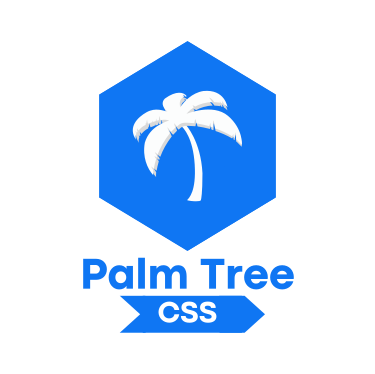

<p align="center">
	
</p>

<p align="center">
	🌴 Minimalist. Modern. Simple. 🌴 An open source CSS library. 
</p>

<p align="center">
	 
	 
	 
	
</p>

## Table of contents

- [Table of contents](#table-of-contents)
- [Add Palm Tree to your project](#add-palm-tree-to-your-project)
- [Keep in mind](#keep-in-mind)
- [Starter template](#starter-template)
- [How to Contribute](#how-to-contribute)

## Add Palm Tree to your project

Copy-paste the stylesheet `<link>` into your `<head>` before all other stylesheets to load our CSS.

```html
<!-- Palm Tree CSS -->
<link
  rel="stylesheet"
  href="https://adonyssantos.me/palm-tree-css/dist/css/style.min.css"
  crossorigin="anonymous"
/>
```

The same but without minifying.

```html
<!-- Palm Tree CSS -->
<link
  rel="stylesheet"
  href="https://adonyssantos.me/palm-tree-css/dist/css/style.css"
  crossorigin="anonymous"
/>
```

## Keep in mind

Palm Tree uses **viewport meta tag** so you need to add it to your `head`.

```html
<meta name="viewport" content="width=device-width, initial-scale=1.0" />
```

## Starter template

We recommend using the HTML5 structure, the initial code should be as follows.

```html
<!DOCTYPE html>
<html lang="en">
  <head>
    <!-- Required meta tags -->
    <meta charset="utf-8" />
    <meta http-equiv="X-UA-Compatible" content="IE=edge" />
    <meta name="viewport" content="width=device-width, initial-scale=1" />

    <!-- Palm Tree CSS -->
    <link
      rel="stylesheet"
      href="https://adonyssantos.me/palm-tree-css/dist/css/style.min.css"
      crossorigin="anonymous"
    />

    <title>Palm Tree</title>
  </head>
  <body>
    <h1>Hello, Palm Tree!</h1>
    <!-- Your code -->
  </body>
</html>
```

## How to Contribute

The contribution guideline is derived from [ConventionalCommits.org](https://www.conventionalcommits.org/)

### Contributor Behavior

Be kind to one another. We're striving to make [Conventional Commits](https://www.conventionalcommits.org/) an inclusive environment that's great for first time open-source contributors.

### Pull Requests

Conventional Commits use the [GitHub flow](https://guides.github.com/introduction/flow/) as main versioning workflow

1. Fork the [Palm Tree](https://github.com/adonyssantos/palm-Tree-css) repository.
2. Create a new branch for each feature, fix or improvement.
3. Send a pull request from each feature branch to **dev** branch.

It is very important to separate new features or improvements into separate feature branches, and to send a pull request for each branch.

This allow us to review and pull in new features or improvements individually.

### Style Guide

All pull requests SHOULD adhere to the [Conventional Commits specification](https://conventionalcommits.org/)

### License

You must agree that your patch will be licensed under the Conventional Commit License, and when we change the license we will assume that you agreed with the change unless you object to the changes in time.
