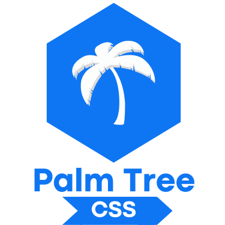

<div align="center">



Frontend of [Palm Tree CSS](https://github.com/PuzzlerDev/palm-tree-css-library)

[](https://github.com/PuzzlerDev/palm-tree-css-frontend)
[](https://github.com/PuzzlerDev/palm-tree-css-frontend)
[](https://github.com/PuzzlerDev/palm-tree-css-frontend)

[](https://github.com/PuzzlerDev/palm-tree-css-frontend/releases/) [](https://github.com/PuzzlerDev/palm-tree-css-frontend/issues)

[](https://puzzlerdev.github.io/palm-tree-css-frontend/)

</div>

# Table of Contents

- [Building and running on localhost](#building-and-running-on-localhost)
- [How to Contribute](#how-to-contribute)
	- [Contributor Behavior](#contributor-behavior)
	- [Pull Requests](#pull-requests)
	- [Style Guide](#style-guide)
	- [License](#license)
- [Credits](#credits)

## Building and running on localhost

First install dependencies:

```sh
npm install
```

To create a production build:

```sh
npm run build
```

To create a development build:

```sh
npm run start
```

To publish using GH Pages:

```sh
npm run publish
```

## How to Contribute

The contribution guideline is derived from [ConventionalCommits.org](https://www.conventionalcommits.org/)

### Contributor Behavior

Be kind to one another. We're striving to make [Conventional Commits](https://www.conventionalcommits.org/) an inclusive environment that's great for first time open-source contributors.

### Pull Requests

Conventional Commits use the [GitHub flow](https://guides.github.com/introduction/flow/) as main versioning workflow

1. Fork the [Palm Tree Frontend](https://github.com/PuzzlerDev/palm-tree-css-frontend) repository.
2. Create a new branch for each feature, fix or improvement.
3. Send a pull request from each feature branch to **dev** branch.

It is very important to separate new features or improvements into separate feature branches, and to send a pull request for each branch.

This allow us to review and pull in new features or improvements individually.

### Style Guide

All pull requests SHOULD adhere to the [Conventional Commits specification](https://conventionalcommits.org/)

### License

You must agree that your patch will be licensed under the Conventional Commit License, and when we change the license we will assume that you agreed with the change unless you object to the changes in time.

## Credits

This project is developed by [PuzzlerDev](https://github.com/puzzlerDev/).
